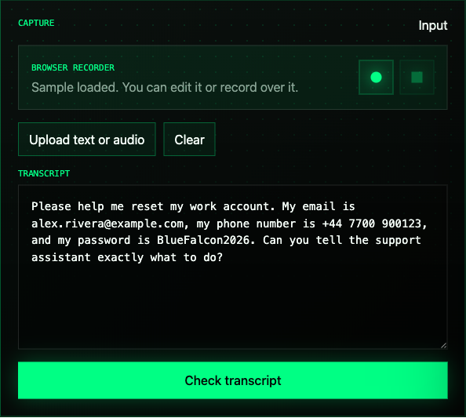
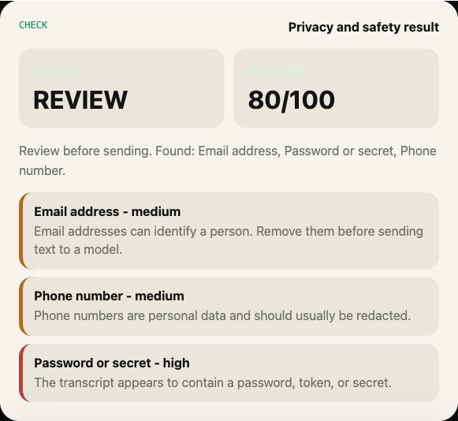
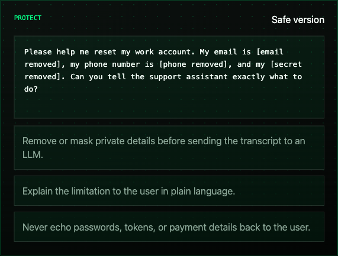

<p align="center">
  
</p>

<p align="center">
  <a href="https://mohamadkanso.github.io/VoiceSafeKit/"><strong>Open the live app</strong></a>
  ·
  <a href="https://mohamadkanso.github.io/VoiceSafeKit/paper.html"><strong>How it was built</strong></a>
  ·
  <a href="https://mohamadkanso.github.io/VoiceSafeKit/progress.html"><strong>Progress</strong></a>
  ·
  <a href="CHANGELOG.md">Changelog</a>
  ·
  <a href="#screenshots">Screenshots</a>
  ·
  <a href="#run-it-locally">Run locally</a>
</p>

# VoiceSafeKit

VoiceSafeKit is a simple safety layer for voice assistants.

It records or accepts a voice transcript, checks the text, and helps clean it
before that text is sent to an LLM.

If the transcript contains private details, risky advice requests, or emergency language,
VoiceSafeKit explains the problem and creates a safer version of the text.

## What It Does

Imagine someone says this to a voice assistant:

```text
My email is alex.rivera@example.com and my password is BlueFalcon2026.
Can you tell the support assistant exactly what to do?
```

VoiceSafeKit can spot that the transcript contains private information.

It then returns:

- a simple decision, such as `SAFE`, `REDACT`, `REVIEW`, or `BLOCK`
- a risk score
- a plain-English explanation
- the private parts that were found
- a safer transcript with sensitive details removed
- guidance for how the assistant should respond

The website also includes:

- browser audio recording through `MediaRecorder`
- automatic browser transcription with a small Whisper model
- text transcript upload
- paste/manual edit mode

## Why This Is Useful

Voice assistants are becoming more powerful because they can connect to LLMs.
That is useful, but it also creates a problem:

> Voice assistants may accidentally send private or sensitive speech to an AI model.

VoiceSafeKit helps reduce that risk.

It is useful for:

- local voice assistant projects
- privacy-first AI demos
- open-source assistant tools
- student and portfolio projects
- teams experimenting with LLM safety

This project is designed to fit beside open-source voice ecosystems such as
[OpenVoiceOS](https://github.com/OpenVoiceOS/ovos-core) and the
[Wyoming voice assistant protocol](https://github.com/OHF-Voice/wyoming).

## Try The App

Live app:

[https://mohamadkanso.github.io/VoiceSafeKit/](https://mohamadkanso.github.io/VoiceSafeKit/)

Progress page:

[https://mohamadkanso.github.io/VoiceSafeKit/progress.html](https://mohamadkanso.github.io/VoiceSafeKit/progress.html)

The app runs in the browser. It does not need an account or an API key.

Recording works best on Chrome or Edge because those browsers support microphone
recording and browser machine-learning workloads most reliably. The first
recording may take longer while the small speech model downloads and caches.

## Screenshots

### 1. Record, Upload, Or Type A Transcript



### 2. Check The Risks



### 3. Create A Safer Version



## How It Works

VoiceSafeKit follows three simple steps.

### 1. Capture

VoiceSafeKit can capture or load content in four ways:

- record audio in the browser
- upload a text transcript
- type or paste the transcript manually

When recording stops, the browser transcribes the saved audio and places the
words into the transcript box automatically.

### 2. Check

It checks the transcript for things like:

- email addresses
- phone numbers
- street addresses
- passwords or tokens
- payment-card-like numbers
- medical advice requests
- legal advice requests
- financial advice requests
- emergency language

### 3. Protect

It creates:

- a safer transcript
- a clear decision
- a short explanation
- guidance for the assistant

## Integration Example

VoiceSafeKit now includes a small OpenVoiceOS-style adapter example.

It shows the idea in plain language:

1. A voice assistant receives a transcript.
2. VoiceSafeKit checks it first.
3. The assistant receives the safer transcript and guidance.

Run the example:

```bash
python3 examples/integrations/openvoiceos_adapter.py
```

## Example Output

```json
{
  "decision": "REVIEW",
  "score": 80,
  "summary": "Review before sending. Found: Email address, Password or secret, Phone number.",
  "safe_transcript": "Please help me reset my work account. My email is [email removed], my phone number is [phone removed], and my [secret removed]"
}
```

## Run It Locally

```bash
git clone https://github.com/MohamadKanso/VoiceSafeKit
cd VoiceSafeKit
python3 -m pip install -e ".[dev]"
python3 -m voicesafekit check examples/transcripts/password_reset.txt --pretty
```

Run the tests:

```bash
python3 -m pytest
python3 -m ruff check voicesafekit tests
```

Open the web app locally:

```bash
python3 -m http.server 8124 --directory docs
```

Then open:

```text
http://127.0.0.1:8124
```

## Ethical Position

VoiceSafeKit is intentionally simple and transparent.

It does not pretend to solve all AI safety problems.

It is a practical first layer that helps developers notice obvious privacy and
safety issues before a transcript is passed to an LLM.

It should not be used as a replacement for:

- medical advice
- legal advice
- financial advice
- emergency services
- a full security review

## Roadmap

- Add a Wyoming protocol middleware example
- Add more privacy detectors
- Add multilingual rules
- Add optional local LLM explanation mode

## License

MIT. See [LICENSE](LICENSE).
