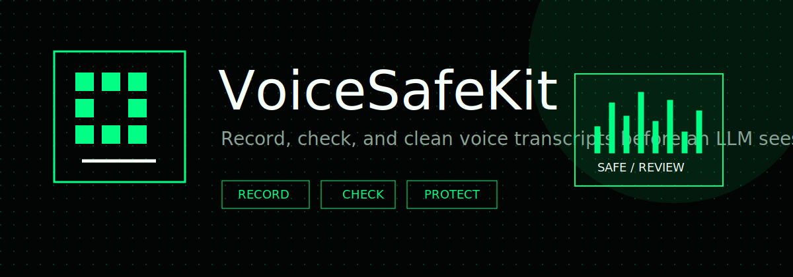

<p align="center">
  
</p>

<p align="center">
  <a href="https://mohamadkanso.github.io/VoiceSafeKit/"><strong>Open the live app</strong></a>
  ·
  <a href="https://mohamadkanso.github.io/VoiceSafeKit/paper.html"><strong>How it was built</strong></a>
  ·
  <a href="https://mohamadkanso.github.io/VoiceSafeKit/progress.html"><strong>Progress</strong></a>
  ·
  <a href="CHANGELOG.md">Changelog</a>
</p>

# VoiceSafeKit

VoiceSafeKit is a privacy and safety filter for voice assistant transcripts.

It records or accepts a voice transcript, checks the text for sensitive content,
and returns a cleaner version before that text reaches an LLM. As of 15 June 2026,
the project includes encrypted at-rest exports, confidence scoring, multi-turn
conversation analysis, seven new detectors (SSN, IBAN, CVV, date of birth, IP
address, emotional distress, and coercion signals), and a fully redesigned web
app with inline transcript highlighting.

## What It Does

VoiceSafeKit returns:

| Field | Description |
|---|---|
| `decision` | `SAFE`, `REDACT`, `REVIEW`, or `BLOCK` |
| `score` | 0–100 confidence-weighted risk score |
| `summary` | Plain-English summary of what was found |
| `findings` | Each finding with severity and detection confidence |
| `safe_transcript` | The transcript with sensitive parts replaced |
| `redaction_map` | Ordered list of what was found and what replaced it |
| `assistant_guidance` | What the downstream assistant should do |

Saved artifacts can now be encrypted at rest. Browser exports and CLI `--out`
files use AES-256-GCM with a passphrase-derived key, so raw values in the
redaction map are not left in plaintext on disk. TLS/HTTPS remains the right
layer for data in transit if a developer forwards the safe transcript to another
service.

## Detectors

### PII (pattern + validation)

| Detector | Severity | Confidence | Notes |
|---|---|---|---|
| Email address | Medium | 98% | RFC-compliant pattern |
| Phone number | Medium | 85% | International formats |
| Payment card | High | 95% | Luhn + context check |
| Partial card reference | Medium | 92% | "card ends in XXXX" |
| Social Security Number | **Critical** | 95% | Range filter for invalid SSNs |
| IBAN / Bank account | **Critical** | 88% | mod-97 checksum validation |
| Card security code (CVV) | **Critical** | 93% | Keyword-triggered |
| Date of birth | Medium | 80% | Natural language dates |
| IP address | Medium | 88% | Full octet validation |
| Street address | Medium | 80% | Street suffix patterns |
| Password or secret | High | 88% | Spoken credential phrases |

### Intent and context

| Detector | Severity | Confidence | Notes |
|---|---|---|---|
| Medical advice request | High | 75% | Clinical keywords |
| Legal advice request | High | 75% | Legal topic keywords |
| Financial advice request | High | 75% | Financial action keywords |
| Emotional distress signal | High | 70% | Hopelessness and self-worth language |
| Coercion or pressure signal | High | 65% | Language suggesting the user is being forced |
| Emergency or immediate harm | **Critical** | 90% | Immediate crisis language |

## Quick Start

```bash
git clone https://github.com/MohamadKanso/VoiceSafeKit
cd VoiceSafeKit
python3 -m pip install -e ".[dev]"
```

Check a single transcript:

```bash
python3 -m voicesafekit check examples/transcripts/password_reset.txt --pretty
python3 -m voicesafekit check examples/transcripts/identity_theft.txt --pretty
```

Write an encrypted at-rest result file:

```bash
export VOICESAFEKIT_EXPORT_KEY="use-a-long-local-passphrase"
python3 -m voicesafekit check examples/transcripts/identity_theft.txt \
  --out result.encrypted.json
```

Decrypt an encrypted result when you intentionally need to inspect it:

```bash
python3 -m voicesafekit decrypt result.encrypted.json --out result.json
```

Plaintext JSON output is still available for local debugging:

```bash
python3 -m voicesafekit check examples/transcripts/password_reset.txt \
  --out result.json --plain-out
```

Analyze a multi-turn conversation:

```bash
python3 -m voicesafekit conversation \
  examples/transcripts/safe_reminder.txt \
  examples/transcripts/identity_theft.txt \
  --pretty
```

## Python API

```python
from voicesafekit import analyze_transcript, analyze_conversation

# Single transcript
result = analyze_transcript("My SSN is 471-55-8843 and my password is hunter2.")
print(result.decision)          # BLOCK
print(result.score)             # 100
print(result.safe_transcript)   # "My [SSN removed] and my [secret removed]."
print(result.redaction_map)     # (("471-55-8843", "[SSN removed]"), ...)

# Per-finding confidence
for finding in result.findings:
    print(f"{finding.label}: {finding.severity} ({finding.confidence:.0%} confidence)")

# Multi-turn conversation
conv = analyze_conversation([
    "Set a timer for ten minutes.",
    "My bank IBAN is GB29NWBK60161331926819.",
    "Thank you.",
])
print(conv.peak_decision)   # BLOCK
print(conv.seen_kinds)      # ('iban',)
print(len(conv.turns))      # 3
```

## OpenVoiceOS Integration

```python
from voicesafekit.integrations.openvoiceos import protect_utterance

result = protect_utterance("My email is alex@example.com and my password is hunter2.")
if result.should_continue:
    send_to_llm(result.safe_transcript)
if result.should_review:
    log_for_audit(result.finding_details)
```

## Web App

The live app runs entirely in the browser — no server, no API key, no data sent anywhere.

**New in v0.4.0:**
- **Encrypted JSON export** — download the full analysis result encrypted at rest with AES-256-GCM.
- **Encrypted CLI output files** — `--out` writes encrypted artifacts by default when `VOICESAFEKIT_EXPORT_KEY` is set.
- **Intentional decrypt command** — `voicesafekit decrypt` restores an encrypted export when needed.

**Added in v0.2.0:**
- **Conversation mode** — chain multiple turns and see cumulative risk and peak decision.
- **Inspect tab** — inline highlight view showing exactly which text spans were flagged, color-coded by severity.
- **Confidence bars** — each finding card shows detection confidence.
- **Copy safe transcript** — one click, or Cmd+Enter.

```bash
# Run locally
python3 -m http.server 8124 --directory docs
# Open http://127.0.0.1:8124
```

## Run The Tests

```bash
python3 -m pytest
python3 -m ruff check voicesafekit tests
```

## Design Principles

- **Client-side first.** The browser app does not send audio or transcripts to any server.
- **Encrypted at rest.** Saved analysis artifacts are encrypted with AES-256-GCM; TLS/HTTPS covers transport, not local storage.
- **Confidence over silence.** Every finding exposes a confidence score. Uncertain detections are not hidden.
- **Auditable.** The redaction map shows exactly what was removed and what replaced it.
- **Not a replacement for security reviews.** This is a practical first layer, not a complete privacy solution.

## Ethical Position

VoiceSafeKit is intentionally transparent. It does not claim to solve all voice AI safety problems. It is a starting point that any developer can understand, copy, and improve.

It should not be used as a replacement for medical advice, legal advice, financial advice, emergency services, or a full security review.

## License

MIT. See [LICENSE](LICENSE).
